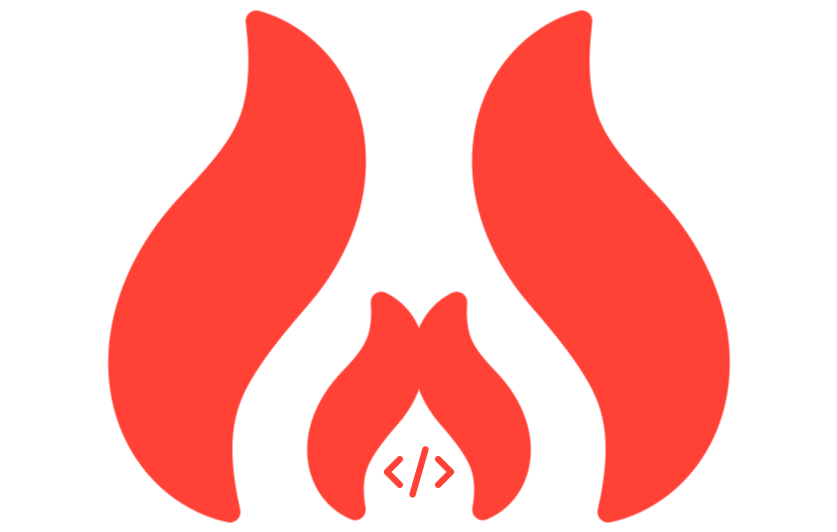

## Learn to Code Smarter

## 🌟 Features

### 🎨 **Visually Enhanced Design** :

I used **React** (JS Framework) with **Tailwind** (CSS Framework) and **daisyUI** (A Tailwind Component Library) to visually improved the design of this project. I researched and analyzed various _Name_ and _logo_ and _tagline_ for this project after that designed a logo and icon for this project.

### 🔄 **Dynamic Data Management** :

I used **useState** and **useEffect** hooks for _dynamic data management feature_.
This will allow users to select course and add it to bucket list and many more. For the `json` data i reseached and found some real data then i upscaled those resouces with ai tools then used opitimization tools to reduce size without loosing quality. After that i hosted those course thumbnails on **[imgur](https://devbytemehedi.imgur.com/all/)**

### 📣 **Interactive Notifications** :

I used `react-toast` package, for visually appealing and interactive toast notifications. Everytime user add or select an course it will show a _toast_ _notification_ saying added successfully if user try to add the same course more than once it will show a _toast_ _notification_ saying already added and lastly if user try cross credit limit it will show a _toast_ _notification_ saying credit limit reached.

## How I managed the state in this assignment project ?

**Answer**: In this assignment project, I implemented state management using React's **useState** hook.
I used **useState** hook to primarily manage two types of data **Number** and **Array**. **Number** was used to update and track the price of the course, credit of the course and **Array** was used for Updating and tracking and managing course bucket list, Course Card Component.

###  📄 **License**
[MIT](./License.md) © [Mehedi Hasan](https://github.com/devbytemehedi)